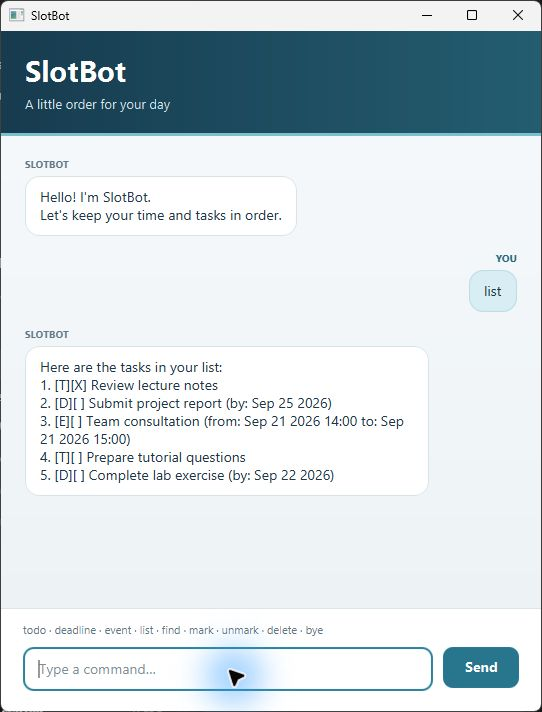

# SlotBot User Guide

SlotBot is a desktop task manager that keeps todos, deadlines, and events in
one simple conversation. Type a command and press **Enter**, or select **Send**.



## Quick start

1. Install Java 25.
2. Download `slotbot.jar` from the latest
   [GitHub release](https://github.com/Dancodes2/ip/releases/latest).
3. Open a terminal in the folder containing the JAR.
4. Run:

   ```text
   java -jar slotbot.jar
   ```

SlotBot saves tasks automatically in `data/slotbot.txt`, relative to the folder
where it is launched. Reopening SlotBot from the same folder restores them.

## Command overview

| Action | Command |
| --- | --- |
| Add a todo | `todo DESCRIPTION` |
| Add a deadline | `deadline DESCRIPTION /by yyyy-MM-dd` |
| Add an event | `event DESCRIPTION /from yyyy-MM-dd HH:mm /to yyyy-MM-dd HH:mm` |
| Show all tasks | `list` |
| Find tasks | `find KEYWORD` |
| Show upcoming deadlines | `reminders` |
| Mark a task complete | `mark NUMBER` |
| Mark a task incomplete | `unmark NUMBER` |
| Delete a task | `delete NUMBER` |
| Exit SlotBot | `bye` |

`DESCRIPTION` and `KEYWORD` may contain spaces. Task numbers come from `list`
or `find` results and start at 1. Dates and times must exist on the calendar;
for an event, the start must be earlier than the end.

## Add tasks

### Todo

Use a todo for a task without a specific date:

```text
todo Review lecture notes
```

### Deadline

Use `/by` followed by a date in `yyyy-MM-dd` format:

```text
deadline Submit project report /by 2026-09-25
```

### Event

Use `/from` and `/to` with date-times in `yyyy-MM-dd HH:mm` format:

```text
event Team consultation /from 2026-09-21 14:00 /to 2026-09-21 15:00
```

SlotBot rejects missing descriptions, invalid dates, repeated separators, and
events whose start is the same as or later than their end.

## View and search tasks

Show the complete numbered task list:

```text
list
```

Find tasks whose descriptions contain a keyword:

```text
find report
```

Searches are case-sensitive. When nothing matches, SlotBot reports the searched
keyword instead of displaying an empty list.

Show unfinished deadlines due today or during the next seven days:

```text
reminders
```

Overdue and completed deadlines are not included. Upcoming deadlines are shown
in due-date order.

## Update tasks

Use the number shown by `list` to mark or unmark a task:

```text
mark 2
unmark 2
```

Delete a task using its number:

```text
delete 2
```

The remaining tasks are renumbered after deletion. SlotBot explains the problem
if a number is missing, not a whole number, or outside the list.

## Exit

Enter the exact command below to save your work and close the window:

```text
bye
```

Leading and trailing spaces are accepted. Extra arguments such as `bye now`
are rejected so that SlotBot does not close unexpectedly.

## Troubleshooting

- If SlotBot cannot load a save file, it starts with an empty list and shows a
  warning.
- Invalid saved records are skipped without preventing valid tasks from loading.
- If saving fails, SlotBot keeps running and displays a warning.
- Task descriptions cannot contain `|` because it separates fields in the save
  file.
